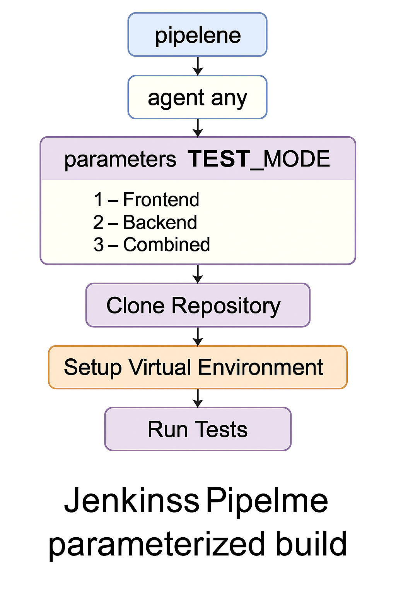

#                    ˜”*°•.˜”*°• Advance DevOps Project •°*”˜.•°*”˜
#                          ˜”*°•.˜”*°• Walaa Hijazi •°*”˜.•°*”˜

## Jenkins-ParameterizedBuild

  

In this branch I built a Jenkins pipeline with several parameters, it was built based on the data in the link:

[https://wiki.jenkins.io/display/JENKINS/Parameterized+Build]

The parameters that was built were three parameters that represents the tests: Frontend, Backend, Combined testing.
#### When the pipeline starts:
- The parameters block: 
   * this block defines the three parameters, 1 - Frontend, 2 - Backend, 3 - Combined the default choice is 3 if no other option was chosen the third option will be built.
- Clone Repository stage:
   * clonning the git repository with the branch name of 'Jenkins-ParameterizedBuild' into Jenkins workspace directory that has the same name as the pipline name in the host machine of Jenkins, in my case it's a Docker container.
- Setup Virtual Environment stage:
   * create a new virtual environment folder.
   * activates the virtual environment.
   * install all the dependencies.
- Run Tests stage:
   * according to what parameter was chosen: one, two or three, the test will run accordingly.
      * before the tests runs the parameters were defined.
      * test_script, server_name and port are defined in this block.
      * for example, 1 has frontend_testing.py as test script, web_app.py as a server name and the port of 5001.
   * the bash script in the stage:
      * activate the virtual environment.
      * start the server that was chosen in the background (run_app.py or web_app.py).
      * Wait for the backend service to be available.
      * if it wasn't available in the defined time the pipeline will fall.
      * finally, the test will run.
      
This pipeline enables selective test execution on demand via “Build with Parameters” in Jenkins. It's ideal for:
- Quick verification of specific app components.
- Saving compute time and resources.
- Manual testing before full CI/CD runs.