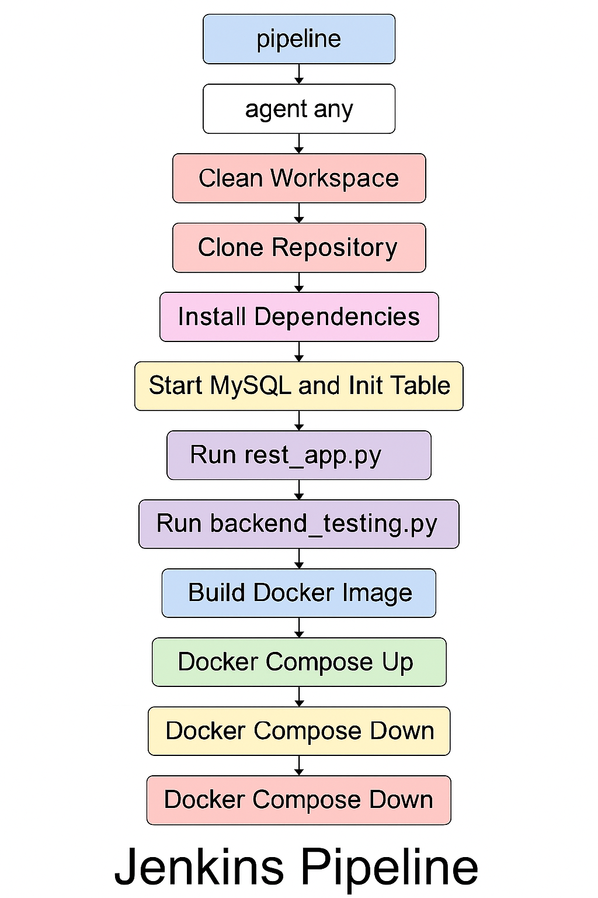
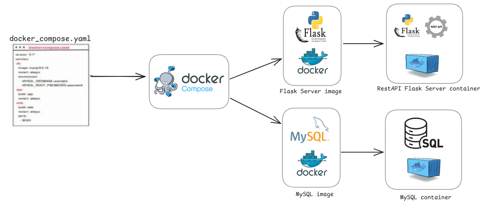

#                    ˜”*°•.˜”*°• Advance DevOps Project •°*”˜.•°*”˜
#                          ˜”*°•.˜”*°• Walaa Hijazi •°*”˜.•°*”˜

  

### Pipeline Explenation:
- The pipeline runs on any available node.
- Before the pipeline I defined an Option block that configures how the pipeline behaves:
   * the block automatically delets old builds and states to delete builds after 5 days, and no more than 20 builds should be saved.
   * the trigger block define when the pipeline should start a build, for example in this specific pipeline it starts building every 30 minutes (every hour).
   * the 'environment' block defines an environment variable that is used through the pipeline.
#### Stages:
- Clean Workspace stage:
   * Clean workspace before pulling fresh repository.
- Clone Repository stage:
   * clonning the git repository with branch name of 'AdvanceProject_Docker_Integration' into Jenkins workspace directory in the host machine of Jenkins, in my case it's a Docker container.
- Update Repostory stage:
   * update all the branches of the clonned repository.
   * ensures the local repository is the same as the remote one (or cloned one).
- Install Dependencies stage:
   * Removes any virtual environment folder.
   * create a new virtual environment folder.
   * activates the virtual environment.
   * install all the dependencies.
- Start MySQL and Init Table stage:
   * remove if there was an sql container.
   * creates an sql docker container.
   * environment variables are passed when the container runs and the port number.
   * creating a volume for MySQL to store its data files persistently.
   * also the volume is mounted from the host machine into the docker container file.
- Run rest_app.py stage:
   * activates the virtual environment.
   * Runs rest_app.py in the background.
   * Wait for the backend service to be available.
   * will return a message, if the backend started or failed. 
- Run backend_testing.py stage:
   * activates the virtual environment.
   * Runs the backend_testing.py to test the Flask server functionality.
- Run clean_environment.py stage:
   * activates the virtual environment.
   * Runs clean_environment.py to stop both backend servers of the rest app flask server.
- Build Docker Image stage:

  

   * I wrote a **_Docker File_** that defines a rest_app image that we will build a container from it, the dockerfile steps are:
      * first a base image is defined.
      * defining a work directory inside the container.
      * copying all the related files to start the server into the work dir.
      * installing all the dependancies that requires to activate the Flask server.
      * telling docker to expose to port 5000.
      * last line, says that reat app will be ran after the container starts.
   * in this stage an image will be built from the dockerfile of the name rest-app-server.
- Push Docker Image & Set Image Version stage:
   * First, we log into Docker securely, fetching credentials from Jenkins credentials, docker's user_name and password.
   * tagging the docker image.
   * push Docker image into my personal Docker hub.
- Check & Install Docker-Compose stage:
   * checks if docker-compose tool is already installed. 
   * if yes, it removes the old binary from both common paths.
   * Now, docker-compose is installed in jenkins workspace.
   * creating a symbolic link from: /usr/local/bin/docker-compose ? /usr/bin/docker-compose.
      * sometimes, different Linux systems or scripts expect docker-compose to be located in /usr/bin.
      * however, after installing it manually (like in your pipeline), docker-compose is typically placed in /usr/local/bin.
      * this link ensures that both paths work — especially helpful if any tools or scripts try to call it from /usr/bin.
      * It's ensuring that inside the container, docker-compose is accessible from /usr/bin, even though it's installed in /usr/local/bin.
- Docker Compose stage:
   * removing the SQL container that has been built before.
   * killing any process that is listening on port 5000.
   * replace image tag in docker-compose.yml that is defined by the BUILD ID.
   * building the docker compose file.
   * the ** _ Docker Compose _ ** file explained:
      * in the docker compose file there are two defined services: sql container and Flask server container.
      ##### SQL Container:
      * in SQL service some configurations are defined: image, container's name, and the mapping of the ports from the host machine to the container's port.
      * enviroment variables are defined to be used in SQL to create a data base, set uo a user's name and with a password.
      * a volume is created inside the container with the name mysql_data, and saves the sql data inside it 
      * a step that checks the health status of the container of the sql service.
      ##### Flask server Container:
      * using the image of the Flask server that was pushed into my personal Docker Hub.
      * a step that makes sure that the sql healthcheck passed successfully, it tell the Flask server to not connect to the data base too early.
      * passing the environments variables of the SQL database in order to connect to it.
      * mapping the port 5000 of the host machine to port 5000 in the container to connect.
- Wait for Docker-Compose stage:
   * curl to the end point (url) in the server: http://127.0.0.1:5000
   * saving the output of the request in dev/null.
   * if the endpoint is not reached it waits for 2 secondsand tries again, it keeps doing that 15 times.
   * if it the endpoint is not reachable through all the 15 vtimes the pipeline will fall.
   * if it is reachable, it will print a passed message that the service is reachable.
- Docker Compose Test:
   * running the backend_testing.py inside the docker container of the Flas Server (Rest App) using docker-compose.
- Docker Compose Down & Remove Image stage:
   * stopping docker-compose tool.
   * stops and removes all the containers defined in the docker compose file, also removes the volumes that is defined in the same docker-compose.
   * orphans: removes the containers that were previously started by Docker Compose but no longer exist in the current docker-compose.yml file.
   * remove the REST app container with the BUILD_ID tag and the MySQL container.
   * force-removes the Docker image rest-app-server from the local image cache.

   
