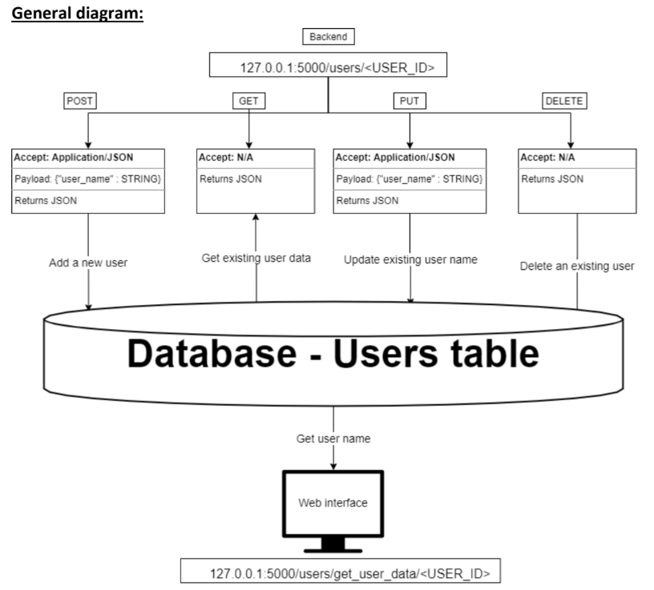

#                    ˜”*°•.˜”*°• Advance DevOps Project •°*”˜.•°*”˜
#                          ˜”*°•.˜”*°• Walaa Hijazi •°*”˜.•°*”˜

The project was devided into parts:

## First Part:
I built a frontend and backend stack using python, General diagram of the this part:

  

## rest_app.py python file: 
represents the backend server of the application.
It exposes a RESTful API that listens on port 5000 and handles HTTP requests at the endpoint:
#### http://127.0.0.1:5000/users/<USER_ID>
Clients can interact with it using the following HTTP methods: 
POST - Add a new user. 
GET - Retrieve user information by ID. 
PUT - Update an existing user's name. 
DELETE - Remove a user from the database.  
Each request expects or returns JSON data, and the server interacts with a MySQL database to persist user data. 

## Data Base - db_connector.py:
The db_connector module handles connection to MySQL database, which in this case hosted on Amazon RDS (Relational Database Cloud Service) using db.t3.micro instance.
#### What does it do:
- Establishes connection to the 'users_data' database.
- Checks for existance a table named 'users'.
  * If it doesn't exist it creats one using SQL.
- Fetches and prints all the rows from the table.
- Returns two objects:
  * Connection: allows interaction with the database.
  * Cursor: enables execution of SQL queries.

## Web Interface, web_app.py:
This module implements a simple Flask-based web interface that interacts with the database and exposes user data through an HTML endpoint.
Endpoint: http://127.0.0.1:5001/users/get_user_data/<user_id>
with:
- 127.0.0.1 – Localhost IP.
- 5001 – Port number where the Flask app is running.
- <user_id> – The dynamic user ID that will be used to look up data in the database.
#### What does it do:
- Retrieves the user_name from the database for a given user_id.
- Returns the response wrapped in an HTML tag with an ID attribute for easier testing using tools like Selenium or BeautifulSoup.

## Testing:
- There are Three modules, which are: backend testing, frontend testing, and combined testing.
- each module runs independntly.

### Backend Testing:
This module performs automated testing of both the REST API and the MySQL database to validate end-to-end functionality.  
The defined target endpoint: http://127.0.0.1:5000/users This is the REST API endpoint exposed by rest_app.py.
#### What does it do:
- POST Request: Submits new user data (user ID, name, and creation timestamp) to the backend using the REST API.
   * Sends the payload in JSON format.
   * Verifies that the response code is 200 OK.
   * Validates that the response is properly formatted JSON.
   * Confirms the success message from the backend.
- GET Request: mmediately retrieves the user by ID via a GET call to confirm that the inserted data is stored and accessible.
   * Asserts that the returned data matches the input.
   * Confirms status code 200.
   * Ensures consistency between what was inserted and retrieved.
#### The purpose of this testing:
- It ensures that the RestAPI is working (by using POST and GET resquest).
- It ensures that the SQL database is functional and saves data porperly.
- Errors or integration issues are caught early during CI (Jenkins) runs.

### Frontend Testing:
This script automates a test of the web interface using Selenium — a powerful browser automation tool.
#### What does it do:
- Launches a headless Chrome browser (no GUI window).
- Sends a GET request to check if the web interface is reachable.
- Navigates to the user-specific page via http://127.0.0.1:5001/users/get_user_data/{user_id}.
- Verifies the page loaded, waits 2 seconds.
- Closes the browser automatically.
#### Purpose:
- To verify that the frontend correctly:
   * Displays the user name in the browser (HTML).
   * Interacts correctly with the backend through the /users/get_user_data/<user_id> route.

### Combination Testing:
This script performs an end-to-end integration test that checks the interaction between the REST API (backend), the SQL database (data layer), and the web interface (frontend) using Selenium.
#### What does it do:
- POST a new user to the backend REST API (http://127.0.0.1:5000/users)
   * Sends a JSON payload with a user name and creation date.
   * Verifies status code 200 (success).
- GET the same user using their new user ID
   * Sends a request to http://127.0.0.1:5000/users/<user_id>.
   * Asserts the returned name matches the one submitted.
- Query the SQL Database directly using pymysql
   * Confirms the user name exists in the database.
   * Extracts the user_id for testing the UI.
- Launches a Selenium session (headless Chrome)
   * Navigates to http://127.0.0.1:5000/users/<user_id>.
   * Verifies the correct user name appears in the web page HTML.
#### Purpose:
To validate the full application stack — ensuring:
- Data flows properly from the user → through the API → to the database.
- Data is correctly retrieved through both the API and the frontend UI.