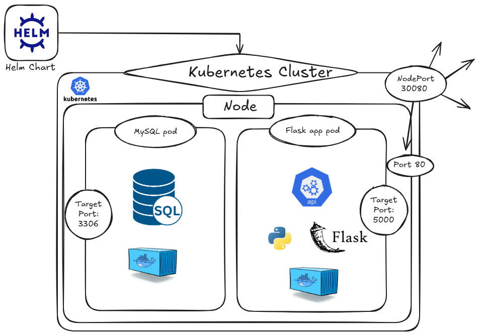

# ˜”*°•.˜”*°• Advance DevOps Project - Kubernetes •°*”˜.•°*”˜
#                  ˜”*°•.˜”*°• Walaa Hijazi •°*”˜.•°*”˜

This project implements a complete CI/CD pipeline using Jenkins. The Jenkins pipeline demonstrates a robust DevOps workflow that integrates automation, continuous integration (CI), and reproducible deployments across environments using modern tools such as Docker, Docker Compose, Kubernetes, and Helm. The pipeline is fully automated—from source code retrieval to application testing and deployment—requiring no manual intervention once triggered.

  

## Jenkins pipeline explenation:
- The pipeline runs on any available node.
- Before the pipeline I defined an Option block that configures how the pipeline behaves:
   * the block automatically delets old builds and states to delete builds after 5 days, and no more than 20 builds should be saved.
- the trigger block define when the pipeline should start a build, for example in this specific pipeline it starts building every 30 minutes (every hour).
- the 'environment' block defines an environment variable that is used through the pipeline.

### Stages:
- Clean Workspace stage:
   * Clean workspace before pulling fresh repository.
- Clone Repository stage:
   * clonning the git repository with branch name of 'AdvanceProject_K8s_Integration' into Jenkins workspace directory in the host machine of Jenkins, in my case it's a Docker container.
- Update Repostory stage:
   * update all the branches of the clonned repository.
   * ensures the local repository is the same as the remote one (or cloned one).
- Install Dependencies stage:
   * Removes any virtual environment folder.
   * create a new virtual environment folder.
   * activates the virtual environment.
   * install all the dependencies.
- Start MySQL and Init Table stage:
   * remove if there was an sql container.
   * creates an sql docker container.
   * environment variables are passed when the container runs and the port number.
   * creating a volume for MySQL to store its data files persistently.
   * also the volume is mounted from the host machine into the docker container file.
- Run rest_app.py stage:
   * activates the virtual environment.
   * Runs rest_app.py in the background.
   * Wait for the backend service to be available.
   * will return a message, if the backend started or failed.
- Run backend_testing.py stage:
   * activates the virtual environment.
   * Runs the backend_testing.py to test the Flask server functionality.
- Run clean_environment.py stage:
   * activates the virtual environment.
   * Runs clean_environment.py to stop both backend servers of the rest app flask server. 
   
**_The explenation of the Docker Compose stages and the testing of the server after creating the server flask container and the sql container is explained in the AdvanceProject_Docker_Integration branch_**

#### Kubernetes Integration via Helm stages:
- Verify Kubernetes Access stage:
   * in this stage, I verify access to a Kubernetes cluster.
   * setting KUBECONFIG as an environment variable that would tells kubectl where is the configuration file of kubernetes is.
   * $HOME/.kube/config is the default path where tools like Minikube or kubectl store cluster credentials and access info.
   * prints details about the Kubernetes cluster, such as:
      * The Kubernetes master (API server) endpoint
      * DNS service and other core components
   * kubectl cluster-info: if this command succeeds, you have access to the cluster and it’s running correctly. If it fails, there may be issues with:
      * Credentials
      * Network access
      * Misconfigured or missing kubeconfig

**_Helm is a Kubernetes package manager. it helps in streamlining the application management by using “Charts” to package the Kubernetes resources. It facilitates simplifying the deployment, upgrades, and dependency resolution within Kubernetes clusters._**

- Install Helm stage:
   * downloads the official Helm installation script from the Helm GitHub repository.
   * | bash: pipes the downloaded script directly into bash to execute it.

#### Helm Chart Folder:

  

- The chart.yaml file:
   * Identifies the chart.
   * Sets metadata like version, description, and type.
- The values.yaml file:
   * Defines default values for the Helm chart, injected into the templates.
   * it has variables that is used in deployments and services inside templates.

- templates Folder:
- deployment.yaml file:
   * Defines how to deploy the Flask app in Kubernetes.
   * replicas: How many Flask app pods to run.
   * Uses the Docker image defined in values.yaml.
   * Injects environment variables for SQL connection.
- mysql-deployment.yaml file:
   * Defines how to deploy MySQL in Kubernetes.
   * Runs MySQL 8.0 with custom credentials.
   * Mounts a volume (emptyDir — non-persistent).
   * One replica for a single DB instance.
- service.yaml file:
   * Defines how to expose the Flask app to the cluster and external world.
   * Uses NodePort to allow external access via <NodeIP>:30080.
   * Maps external port 80 to Flask container's port 5000.
   * Selector: means the Service routes traffic to Pods that have a specific label, in the case of this file it maps it to rest-app-server (label) pod.
- mysql-service.yaml file:
   * Creates a ClusterIP service for MySQL.
   * Lets the Flask app talk to the DB using the name mysql-service and port 3306.
   * Ensures internal networking between services.

  

- Deploy Helm Chart stage:
   * setting KUBECONFIG as an environment variable that would tells kubectl where is the configuration file of kubernetes is.
   * If the release rest-app-server already exists → upgrade it.
   * If not → install a new release.
   * Upgrade an existing release named rest-app-server by using the configuration of deplyment.yaml and service.yaml in chart folder.
   * it sets the image of the server tags it based on the build_id.
- Port Forward Service & Write URL stage:
   * Opens access to the Flask app (port 80 → 5001) and MySQL (port 3306) from Jenkins by port-forwarding.
   * kill any running kubectl port-forward processes in order to avoid errors.
   * **Port-forward Flask app:**
      * Forwards local port 5001 to port 80 of the Kubernetes service hello-python-service (an arbitatry name)
      * nohup ... & runs it in the background, even if the shell closes.
      * Logs are saved to portforward_app.log.
   * **Port-forward MySQL:**
      *  forwards port 3306 to the MySQL service inside the cluster
   * Tries up to 10 times (every 2 seconds) to check if both ports are open (ports:5001 and 3306).
   * it checks if the port-forwarding process in both ports is successful, if both are listenning the loop breaks down and it goes to the next step.
   * the endpoint url is saved into k8s_url.txt file, Saving the URL to k8s_url.txt serves an important automation purpose in the Jenkins pipeline:
      * Jenkins stages don’t automatically share variables, so writing the service URL to a file allows subsequent stages (like testing scripts) to read the actual accessible URL from disk.
      * Since the Flask service is only reachable on localhost:5001 due to port forwarding, storing the reachable URL ensures tests are targeting the correct endpoint (especially in Jenkins where context may change)
- Kubernetes Backend Test stage:
   * Running python script K8S_backend_testing.py from Jenkins, but that script relies on reading database connection parameters.
   * Environment variables are defined to allow us to access the SQL database.
   * Runs a Python test (K8S_backend_testing.py) that:
      * POSTs a new user to the Flask app.
      * Verifies it's written into the MySQL DB.
      * Reads it back via a GET request.
   * this stage verifies that the deployed backend works correctly with the database in Kubernetes.
- Clean HELM Environment stage:
   * Removes the Kubernetes release after testing.
	 * Deletes the helm release: rest-app-server from the Kubernetes cluster
	 * || true: If the command fails (rest-app-server doesn't exist), ignore the error and continue.
   

   
**_Continuous Delivery (CD)_** is a DevOps practice where code changes are automatically built, tested, and prepared for a release to production. The goal is to ensure that software can be reliably and consistently deployed at any time with minimal manual effort.
While Continuous Integration (CI) focuses on testing and merging code frequently, CD takes it a step further by automating the delivery of the application to environments like staging or production after those tests pass.
**_This project_** demonstrates CD through the automation of build, packaging, deployment, testing, and cleanup using Docker and Kubernetes.
The Jenkins pipeline embodies Continuous Delivery by:
- Automatically building and packaging code.
- Tagging and pushing Docker images to a remote registry.
- Deploying to Kubernetes using Helm.
- Verifying deployments through automated tests.
- Cleaning up environments post-deployment.